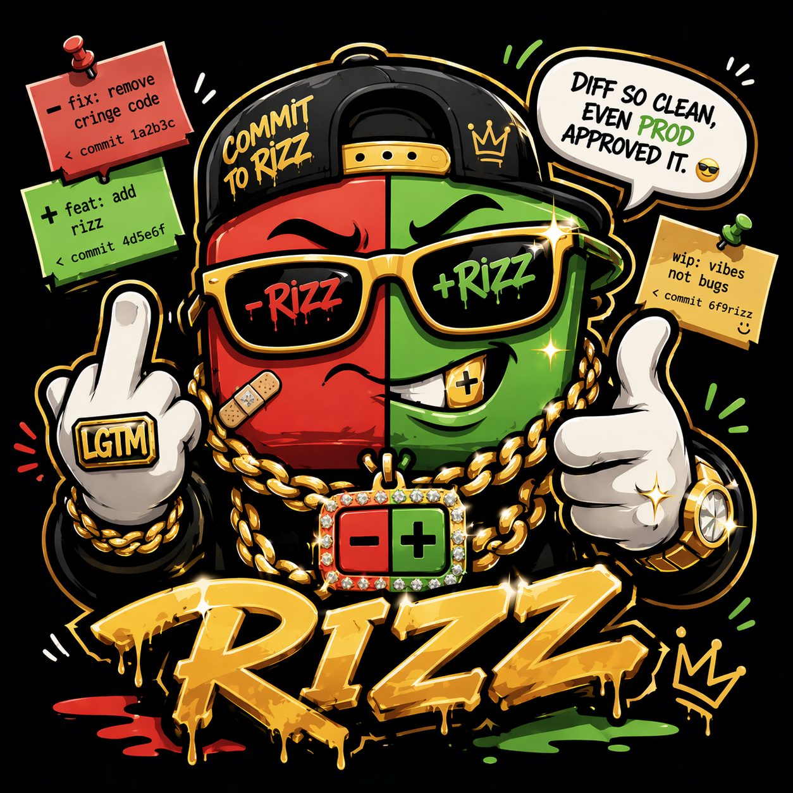
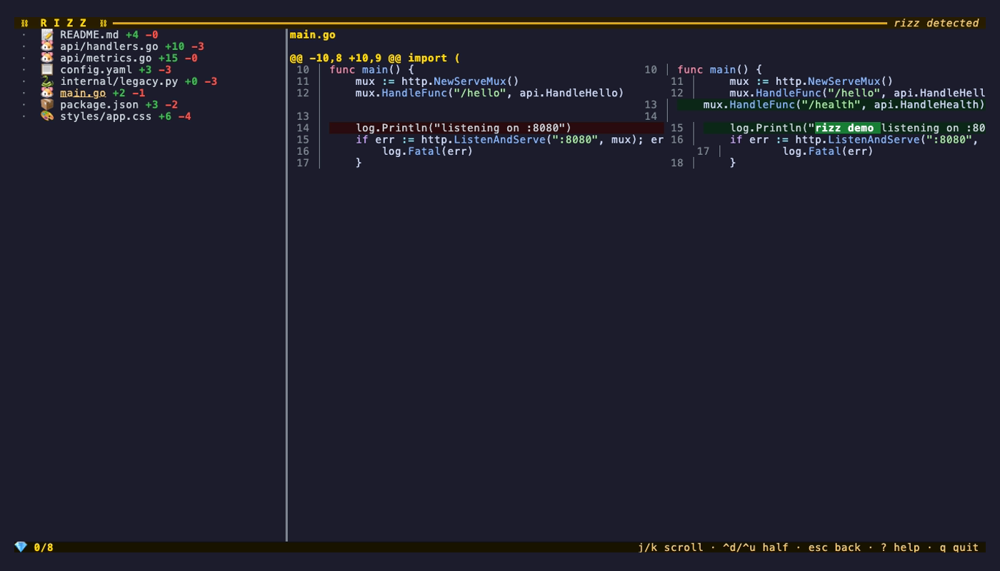
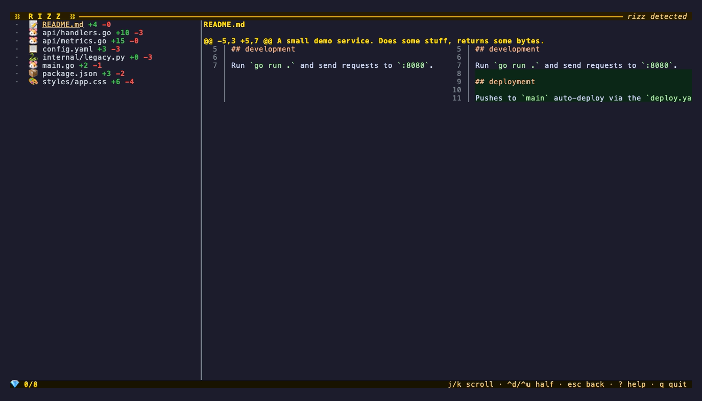
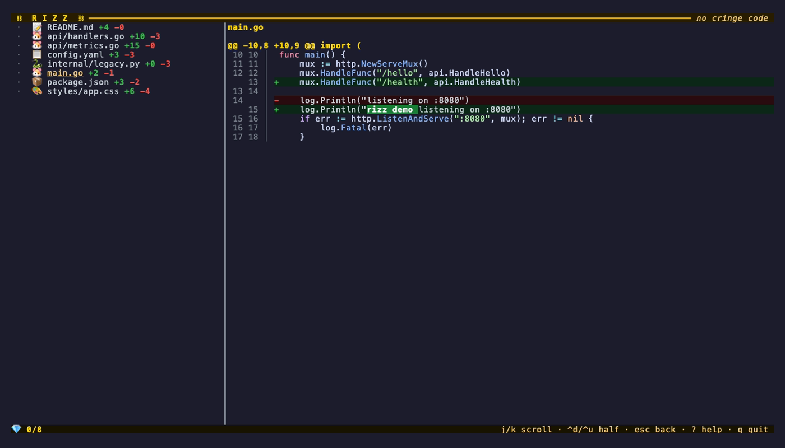
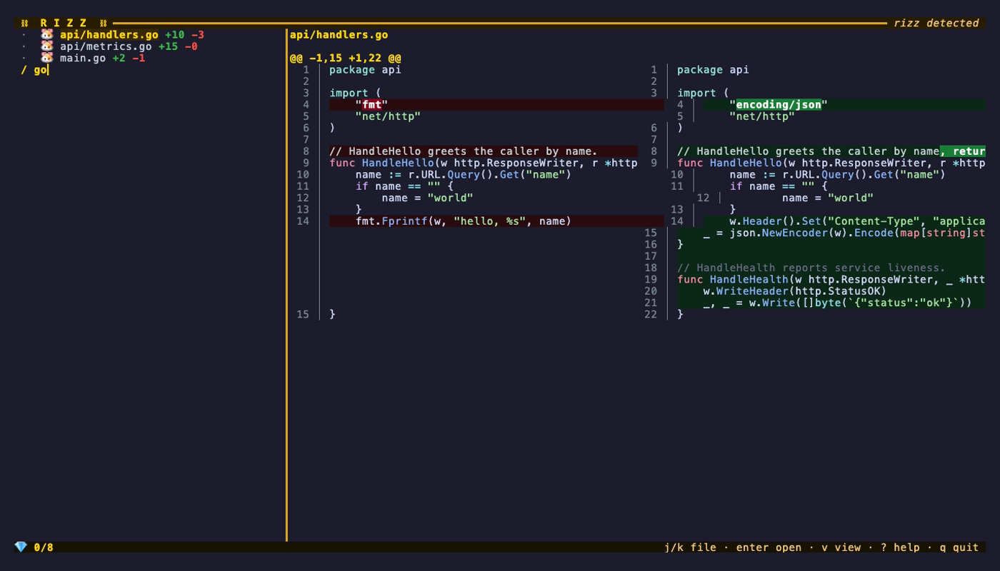

<h1 align="center">
  
</h1>

<p align="center">
  <b>Review your own diffs with a little extra rizz.</b><br/>
  <i>A terminal code review tool for when you've got drip but no PR.</i>
</p>

<p align="center">
  
  
  
</p>

<p align="center">
  
</p>

---

## diff so clean, even prod approved it

`rizz` is a terminal TUI that gives you GitHub's "Files Changed" experience for your own uncommitted changes locally. Scroll the diff, check files off as you review them, ship with confidence — no PR required.

Built for the solo dev, the vibe-coder, the one who ships straight to main and still wants to look over 14 AI-generated files before `git push`.

## why tho

You're deep in the zone. Your AI bestie just wrote half a feature. You need to actually _read the diff_ before committing. Your options:

- ❌ Open a PR, review yourself, merge, pull main, delete branch. That's **five steps** for solo work.
- ❌ Blast through `git diff` in a dumb pager and hope you don't miss a file.
- ❌ Boot lazygit, get overwhelmed by 47 panels, rage-quit.
- ✅ Run `rizz`. Scroll. Check. Ship.

## install

**oneliner (macOS / Linux)** — grabs the right prebuilt binary for your OS and drops it in `~/.local/bin`:

```bash
curl -fsSL https://raw.githubusercontent.com/Gogoro/rizz/main/install.sh | sh
```

**Go devs:**

```bash
go install github.com/Gogoro/rizz@latest
```

**Manual:** grab a binary from [Releases](https://github.com/Gogoro/rizz/releases) and drop it on your `$PATH`.

**From source:**

```bash
git clone https://github.com/Gogoro/rizz.git
cd rizz
go build
mv rizz /usr/local/bin/
```

Requires Go 1.22+ for source / `go install`.

## try it

A demo script spins up a throwaway git repo with varied, realistic changes (Go, CSS, YAML, Markdown, tests, new files, deleted files) so you can see rizz actually working:

```bash
./demo/setup.sh
cd /tmp/rizz-demo
rizz
```

## usage

```bash
# review your uncommitted changes (default)
rizz

# review staged changes only
rizz --staged

# review your branch vs main (or any ref)
rizz --base main
rizz --base origin/develop
rizz --base v1.2.0

# swap the syntax theme
rizz --theme dracula
rizz --theme list        # print all available themes

# skip the boot animation
rizz --no-splash

# force inline mode (default is side-by-side)
rizz --inline
```

## features

### two-pane navigation

Sidebar on the left with every changed file. Big diff on the right. Focus flips between them: `enter` to dive into the diff, `esc` to jump back to the file list. Muscle memory stays consistent — `j/k` always means "move" in whichever pane has focus.

### viewed tracking that doesn't lie

Mark files with `v` (or space), track with the 💎 diamond marker. State lives in `.git/rizz-state.json` per repo — no global mess.

Each viewed mark is keyed to a hash of that file's diff content. When the diff changes (you commit, you edit, anything), the mark auto-invalidates. Same behavior as GitHub's "Viewed" checkbox on PRs.

Hit `U` to jump to the next unviewed file.

### side-by-side diff

Default view. Old version on the left, new on the right, line numbers on both sides — same flow as GitHub's split view. Changed words pop with intra-line highlighting on paired removals/additions.

<p align="center"></p>

Prefer classic unified diffs? Press `s` to toggle, run with `--inline`, or type `:inline`. Your preference sticks across runs.

<p align="center"></p>

Narrow terminals automatically fall back to inline so things stay readable.

### syntax highlighting

Powered by [Chroma](https://github.com/alecthomas/chroma) — ~200 languages detected by filename. Default theme is `catppuccin-mocha`. Swap with `--theme <name>` or set `theme = "dracula"` in the config file.

<p align="center"></p>

### word-level diff

For isolated `-` / `+` line pairs, rizz highlights the exact changed words with a brighter background. Small renames, tweaks, and typos pop immediately.

<p align="center"></p>

### line numbers

GitHub-style gutter: old line number on the left, new line number on the right, muted so they don't dominate.

### file filter

Press `/`, start typing, file list narrows in real time to path substring matches. `esc` clears. Handy when 47 files changed and you only want to review the Go ones.

<p align="center"></p>

### commit message suggestions

Press `m` for a vibey commit message generator that reads your file types and operations and spits out suggestions in the logo's style (`feat: add rizz`, `fix: remove cringe code`, `style: drip check passed`, etc.).

### help overlay

`?` anywhere — modal popup with every keybinding grouped by mode.

### vim-style commands

Press `:` for a command prompt. `:q`, `:quit`, `:help`, `:a`, `:r` all work. `:w` tells you that rizz doesn't write, it only reviews.

### the easter egg

Type `r-i-z-z` anywhere. You'll see.

### mouse support

Click a file to open it. Scroll wheel navigates the file list in the sidebar and scrolls the diff in the main pane.

### boot splash

A little ⛓ RIZZ ⛓ flex on launch. Press any key to skip, or run with `--no-splash`.

### file type flex

`rizz` drops an emoji next to each file so you can skim what's changing at a glance:

| ext            | icon | ext         | icon | ext            | icon |
| -------------- | ---- | ----------- | ---- | -------------- | ---- |
| `.go`          | 🐹   | `.ts`       | 🟦   | `.js`          | 🟨   |
| `.py`          | 🐍   | `.rs`       | 🦀   | `.rb`          | ♦️   |
| `.css` `.scss` | 🎨   | `.html`     | 🌐   | `.md`          | 📝   |
| `.json`        | 📦   | `.yaml`     | 📋   | `.toml` `.ini` | ⚙️   |
| `.sh` `.bash`  | 🐚   | `.sql`      | 🗄   | `Dockerfile`   | 🐳   |
| `Makefile`     | 🔨   | `*_test.go` | 🧪   | images         | 🖼   |
| `.env`         | 🔐   | `.lock`     | 🔒   | anything else  | 📄   |

## keybindings

Two focus modes: **file list** on the left, **diff view** on the right. `enter` to open, `esc` to return.

**list mode**

| key                   | action             |
| --------------------- | ------------------ |
| `j` · `k` · `↑` · `↓` | move between files |
| `g` · `G`             | first · last file  |
| `enter` · `l` · `→`   | open diff view     |

**diff mode**

| key                                   | action               |
| ------------------------------------- | -------------------- |
| `j` · `k` · `↑` · `↓`                 | scroll the diff      |
| `ctrl+d` · `ctrl+u` · `d` · `u`       | half-page down · up  |
| `ctrl+f` · `ctrl+b` · `pgdn` · `pgup` | full page down · up  |
| `g` · `G`                             | top · bottom of diff |
| `esc` · `h` · `←`                     | back to list         |

**works in both modes**

| key               | action                     |
| ----------------- | -------------------------- |
| `n` · `tab`       | next file                  |
| `p` · `shift+tab` | previous file              |
| `U`               | jump to next unviewed      |
| `v` · `space`     | toggle viewed 💎           |
| `a`               | mark all viewed            |
| `r`               | reset all                  |
| `s`               | toggle side-by-side / inline |
| `/`               | filter files (esc clears)  |
| `m`               | commit message suggestions |
| `:`               | vim-style command          |
| `?`               | help overlay               |
| `q` · `ctrl+c`    | quit                       |

Mouse: click a file in the sidebar to open it; scroll wheel navigates the sidebar or scrolls the diff depending on where you hover.

## config file

Optional. Drop a TOML file at `~/.config/rizz/config.toml`:

```toml
# override the syntax theme
theme = "dracula"

# always skip the boot splash (same as --no-splash on every launch)
no_splash = true

# add alternate keys for any action.
# your custom keys work *in addition to* the built-in defaults.
[keybinds]
view-toggle    = "V"
help           = "F1"
next-unviewed  = "x"
commit-msgs    = "M"
```

Run `rizz --theme list` to see all available chroma themes.

## cli flags

| flag             | purpose                                           |
| ---------------- | ------------------------------------------------- |
| `--base <ref>`   | compare current branch vs a ref (uses merge-base) |
| `--staged`       | review only staged changes                        |
| `--theme <name>` | override syntax theme (use `list` to print all)   |
| `--no-splash`    | skip the boot animation                           |
| `--inline`      | start in inline diff mode instead of side-by-side |

## what's NOT here (yet)

- No inline comments or annotations
- `rizz` is strictly read-only — no staging, committing, or any git mutation

If any of these would genuinely make your life better, open an issue.

## credits

Built with 💛 using:

- [Bubble Tea](https://github.com/charmbracelet/bubbletea) and [Lip Gloss](https://github.com/charmbracelet/lipgloss) by [Charm](https://charm.sh/)
- [Chroma](https://github.com/alecthomas/chroma) for syntax highlighting
- [sourcegraph/go-diff](https://github.com/sourcegraph/go-diff) for unified diff parsing
- [sergi/go-diff](https://github.com/sergi/go-diff) for word-level intra-line diffing
- [BurntSushi/toml](https://github.com/BurntSushi/toml) for config parsing

## license

MIT. Do whatever you want.

---

<p align="center">
  <i>commit to rizz.</i> 👑
</p>
